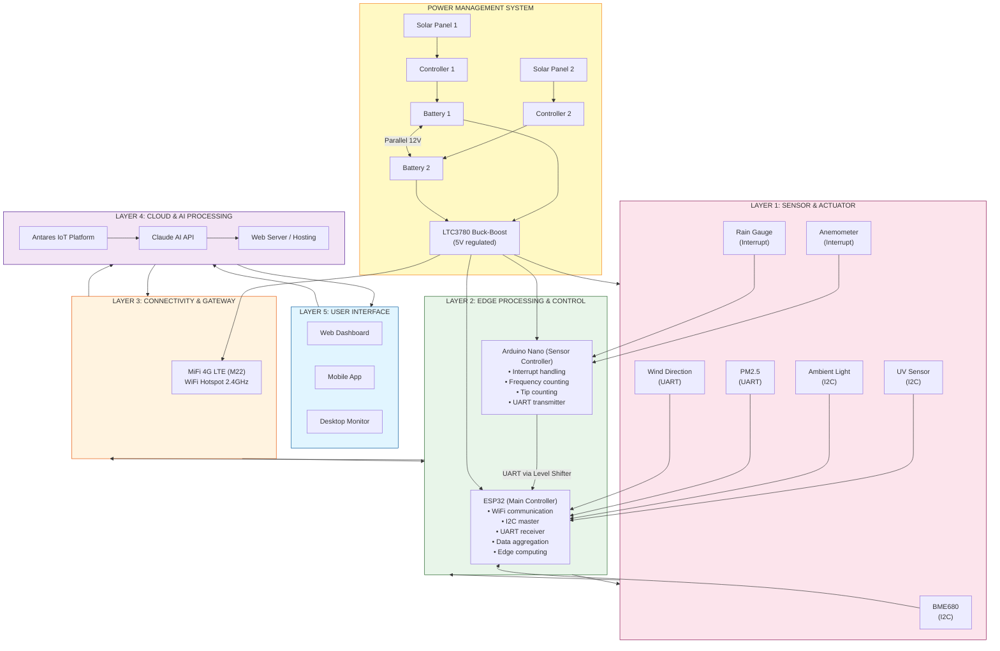
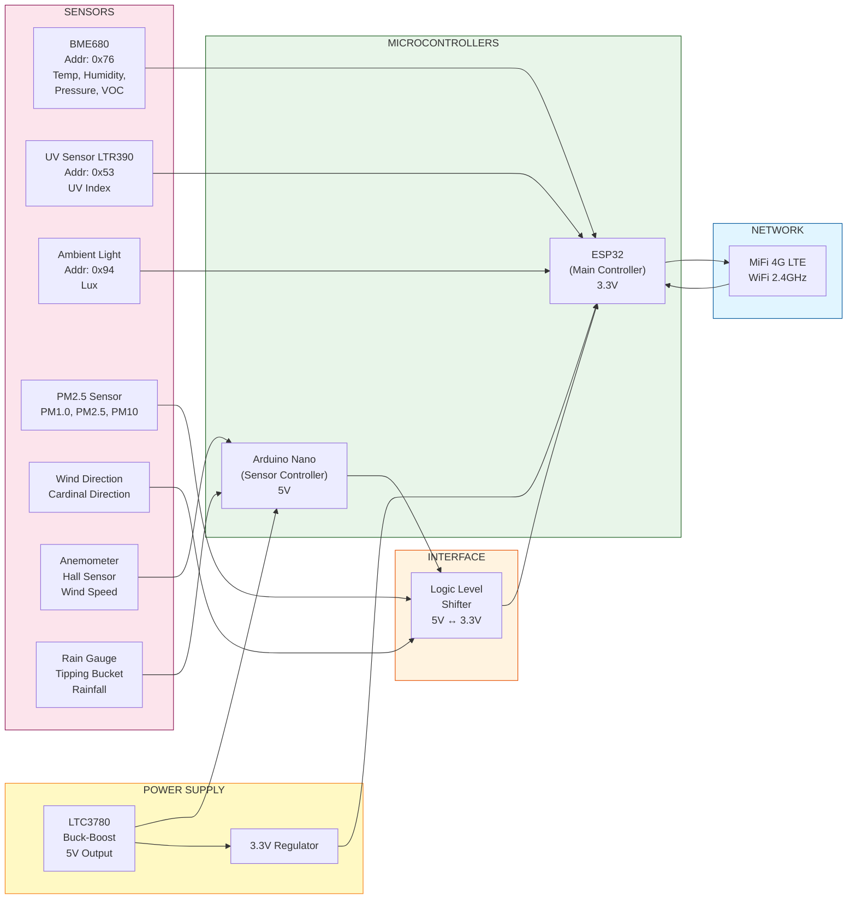
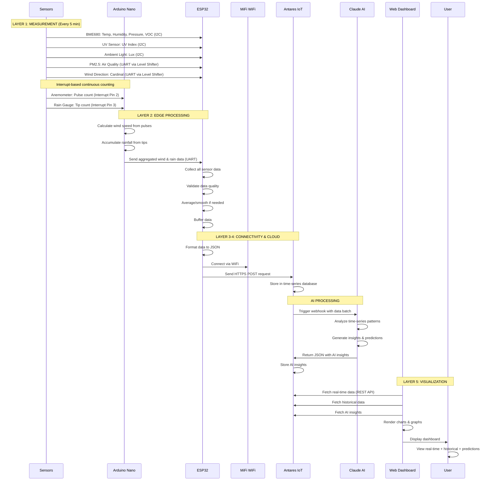
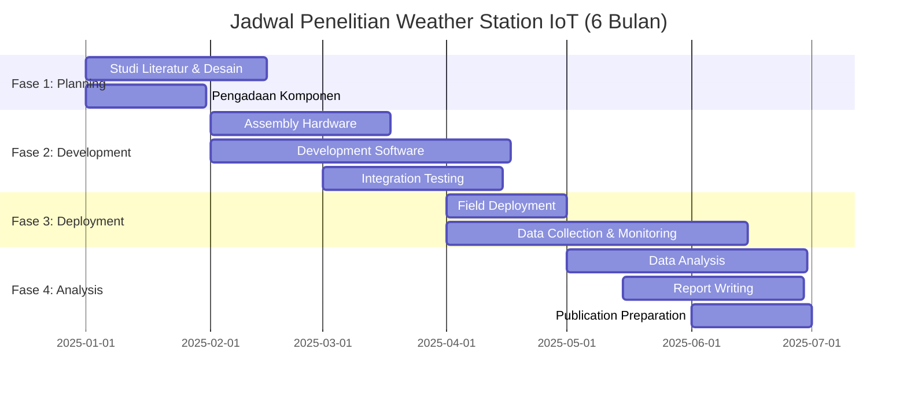
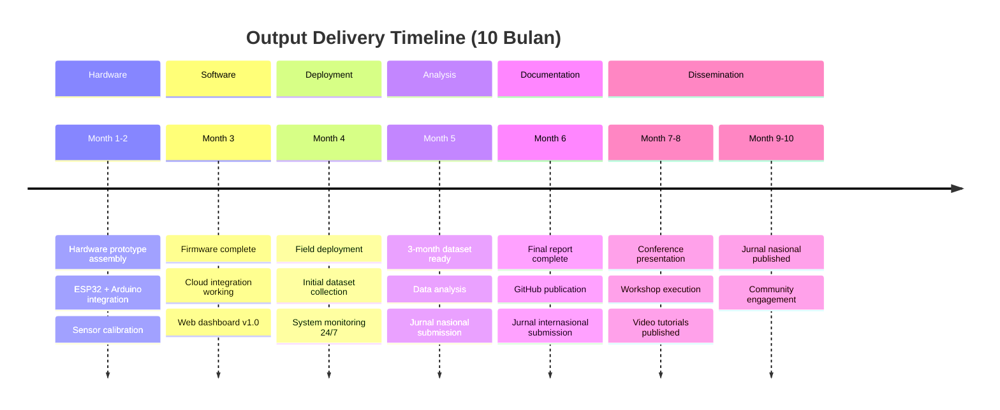
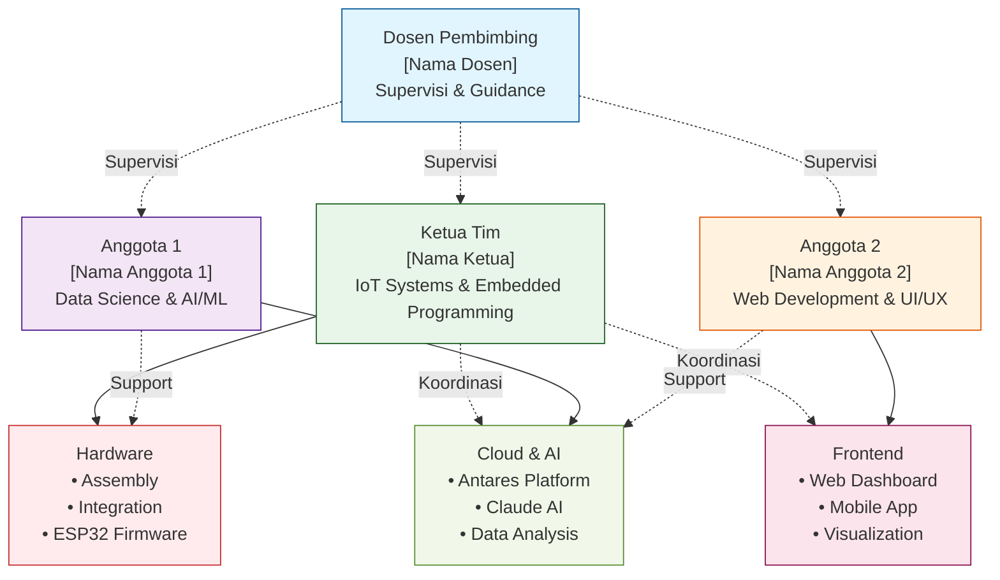

# PROPOSAL PENELITIAN
## Sistem Monitoring Cuaca Komprehensif Berbasis IoT dengan Integrasi Cloud Platform dan Artificial Intelligence

---

**Pengusul:**
- Ketua: [Nama Peneliti Utama]
- Anggota 1: [Nama Anggota]
- Anggota 2: [Nama Anggota]

**Institusi:** [Nama Universitas/Institusi]
**Program Studi:** [Nama Prodi]
**Tahun Pelaksanaan:** 2025

---

## HALAMAN PENGESAHAN

Proposal penelitian ini telah disetujui untuk dilaksanakan:

**Judul Penelitian:**
Sistem Monitoring Cuaca Komprehensif Berbasis IoT dengan Integrasi Cloud Platform dan Artificial Intelligence

**Peneliti:**
- Ketua: ______________________ (NIM/NIP: ____________)
- Anggota 1: __________________ (NIM/NIP: ____________)
- Anggota 2: __________________ (NIM/NIP: ____________)

**Waktu Pelaksanaan:** 6 bulan (Januari - Juni 2025)
**Total Anggaran:** Rp 35.156.000,- (Tiga Puluh Lima Juta Seratus Lima Puluh Enam Ribu Rupiah)

**Lokasi Penelitian:**
- Laboratorium: [Nama Lab], [Fakultas], [Universitas]
- Field Testing: [Lokasi Outdoor Deployment]

Mengetahui,

**Ketua Program Studi**                    **Dosen Pembimbing**


(___________________)                      (___________________)
NIP.                                      NIP.


**Ketua Tim Peneliti**


(___________________)
NIM/NIP.

Tanggal: _______________

---

# RINGKASAN EKSEKUTIF

Penelitian ini bertujuan untuk mengembangkan sistem monitoring cuaca komprehensif berbasis Internet of Things (IoT) yang mampu mengukur 10 parameter cuaca secara simultan dan real-time. Sistem mengintegrasikan 7 jenis sensor presisi (BME680, Anemometer, Wind Direction, Rain Gauge, Ambient Light, UV, dan PM2.5) dengan mikrokontroler ESP32 dan Arduino Nano, platform cloud Antares IoT, serta Artificial Intelligence (Claude AI) untuk analisis prediktif.

Keunggulan sistem ini adalah operasi mandiri 24/7 menggunakan dual solar panel system, akses data real-time melalui web dashboard dan mobile app, serta kemampuan analisis AI untuk insight generation dan short-term weather prediction. Total anggaran penelitian Rp 35.156.000 untuk periode 6 bulan dengan target menghasilkan prototype fungsional, publikasi ilmiah, dan open-source dataset.

**Kata Kunci:** IoT, Weather Monitoring, Cloud Computing, Artificial Intelligence, Solar Power, Real-time System

---

# DAFTAR ISI

- [BAB I: PENDAHULUAN](#bab-i)
- [BAB II: TINJAUAN PUSTAKA](#bab-ii)
- [BAB III: METODOLOGI PENELITIAN](#bab-iii)
- [BAB IV: RENCANA ANGGARAN BIAYA](#bab-iv)
- [BAB V: JADWAL PELAKSANAAN](#bab-v)
- [BAB VI: OUTPUT DAN LUARAN](#bab-vi)
- [BAB VII: TIM PENELITI](#bab-vii)
- [BAB VIII: MANAJEMEN RISIKO](#bab-viii)
- [BAB IX: PENUTUP](#bab-ix)
- [LAMPIRAN](#lampiran)
- [DAFTAR PUSTAKA](#daftar-pustaka)

---

# BAB I
## PENDAHULUAN

### 1.1 Latar Belakang

Perubahan iklim global telah menjadi isu krusial yang mempengaruhi berbagai aspek kehidupan manusia. Data dari World Meteorological Organization (WMO) menunjukkan peningkatan frekuensi kejadian cuaca ekstrem sebesar 35% dalam dua dekade terakhir (WMO, 2023). Indonesia, sebagai negara kepulauan dengan iklim tropis, sangat rentan terhadap dampak perubahan iklim ini.

Sistem monitoring cuaca yang akurat dan real-time menjadi kebutuhan mendesak untuk berbagai sektor:
- **Pertanian**: Optimasi jadwal tanam dan panen, prediksi penyakit tanaman
- **Transportasi**: Early warning untuk navigasi udara dan laut
- **Manajemen Bencana**: Deteksi dini banjir, longsor, dan cuaca ekstrem
- **Perencanaan Kota**: Data untuk urban planning dan mitigasi heat island
- **Kesehatan**: Monitoring kualitas udara dan UV index

Namun, sistem monitoring cuaca konvensional menghadapi beberapa keterbatasan:
1. **Biaya tinggi**: Stasiun cuaca profesional berharga ratusan juta rupiah
2. **Coverage terbatas**: Jarak antar stasiun BMKG bisa mencapai puluhan kilometer
3. **Akses data terbatas**: Data real-time sulit diakses publik
4. **Instalasi kompleks**: Memerlukan infrastruktur dan tenaga ahli khusus

Perkembangan teknologi **Internet of Things (IoT)** membuka peluang solusi inovatif. Sensor-sensor cuaca presisi kini tersedia dengan harga terjangkau, mikrokontroler powerful seperti ESP32 memungkinkan edge computing, dan platform cloud menyediakan storage unlimited dengan biaya rendah. Integrasi dengan **Artificial Intelligence (AI)** menambah nilai dengan kemampuan analisis prediktif dan pattern recognition.

Penelitian ini mengusulkan pengembangan sistem monitoring cuaca berbasis IoT yang:
- **Komprehensif**: Mengukur 10 parameter cuaca secara simultan
- **Real-time**: Data ter-update setiap 5 menit dan dapat diakses langsung
- **Autonomous**: Operasi mandiri 24/7 dengan solar power
- **Intelligent**: AI-powered analysis untuk insight dan prediksi
- **Affordable**: Total biaya ~1/10 dari stasiun cuaca komersial
- **Open**: Data dan source code akan di-open source untuk replikasi

### 1.2 Rumusan Masalah

Berdasarkan latar belakang di atas, penelitian ini akan menjawab pertanyaan berikut:

1. **Desain Sistem**: Bagaimana merancang arsitektur sistem monitoring cuaca berbasis IoT yang dapat mengukur 10 parameter cuaca (suhu, kelembaban, tekanan udara, VOC/kualitas udara, PM2.5, UV index, intensitas cahaya, kecepatan angin, arah angin, curah hujan) secara akurat dan simultan?

2. **Integrasi Cloud**: Bagaimana mengintegrasikan sistem sensor dengan platform cloud IoT (Antares) untuk storage, processing, dan akses data real-time dengan reliability > 95%?

3. **AI Implementation**: Bagaimana memanfaatkan teknologi AI (Claude AI) untuk analisis data time-series, pattern recognition, dan prediksi cuaca jangka pendek (3-6 jam)?

4. **Power Management**: Bagaimana merancang sistem power supply berbasis dual solar panel yang dapat support operasi 24/7 tanpa interruption termasuk pada kondisi cuaca mendung/hujan?

5. **User Interface**: Bagaimana mengembangkan dashboard web dan mobile app yang user-friendly untuk visualisasi data real-time, historical trend, dan AI-generated insights?

6. **Validasi & Akurasi**: Bagaimana memvalidasi akurasi sistem dengan membandingkan data yang dihasilkan dengan data stasiun cuaca resmi (BMKG) dengan target error rate < 5%?

7. **Scalability**: Bagaimana memastikan sistem dapat direplikasi dan di-scale untuk deployment multiple lokasi dengan biaya efektif?

### 1.3 Tujuan Penelitian

#### 1.3.1 Tujuan Umum
Mengembangkan sistem monitoring cuaca berbasis IoT yang komprehensif, akurat, real-time, dan affordable dengan integrasi cloud platform dan AI untuk mendukung pengambilan keputusan berbasis data cuaca.

#### 1.3.2 Tujuan Khusus

**Hardware & Embedded System:**
1. Merancang dan mengimplementasikan weather station IoT yang mengukur 10 parameter cuaca secara simultan dengan sampling rate 5 menit
2. Membangun sistem power management berbasis dual solar panel (2x100W) dengan dual battery (2x12V 65AH) untuk autonomous operation 24/7
3. Mengintegrasikan 7 sensor presisi dengan 2 mikrokontroler (ESP32 + Arduino Nano) melalui protokol I2C, UART, dan Interrupt-based communication

**Software & Cloud Integration:**
4. Mengembangkan firmware embedded system dengan fitur: data acquisition, edge processing, buffering, dan cloud synchronization
5. Mengintegrasikan sistem dengan Antares IoT Platform untuk data storage, visualization, dan API access
6. Membangun web dashboard responsif dan mobile app untuk real-time monitoring dan historical data analysis

**AI & Analytics:**
7. Mengimplementasikan AI system menggunakan Claude AI API untuk:
   - Time-series data analysis
   - Weather pattern recognition
   - Short-term prediction (3-6 hours ahead)
   - Anomaly detection
   - Automated insight generation

**Validation & Documentation:**
8. Melakukan validasi akurasi sistem melalui comparison testing dengan data BMKG selama minimal 3 bulan
9. Menghasilkan dataset cuaca berkualitas untuk kepentingan riset lanjutan
10. Mendokumentasikan sistem secara lengkap untuk replikasi dan open-source publication

### 1.4 Manfaat Penelitian

#### 1.4.1 Manfaat Akademis

**Kontribusi Keilmuan:**
- Memberikan kontribusi dalam bidang **IoT systems engineering**, khususnya untuk aplikasi environmental monitoring
- Menghasilkan **metodologi integrasi AI** dengan IoT weather station untuk predictive analytics
- Menyediakan **case study** implementasi edge computing pada resource-constrained embedded system
- Menambah literatur tentang **solar power system design** untuk IoT devices continuous operation

**Publikasi & Disseminasi:**
- Target publikasi: **2 artikel jurnal** (1 nasional terakreditasi SINTA, 1 international)
- **Conference paper** di konferensi IoT/embedded system (nasional/international)
- **GitHub repository** dengan complete documentation untuk academic community
- **Dataset cuaca** 6 bulan untuk public research use

**Pendidikan:**
- Menjadi **referensi praktis** untuk mata kuliah IoT, Embedded Systems, dan Instrumentasi
- **Teaching material** untuk lab praktikum sistem embedded dan sensor
- **Final project reference** untuk mahasiswa S1/S2

#### 1.4.2 Manfaat Praktis

**Sektor Pertanian:**
- Farmer dapat access data **micro-climate** untuk optimasi jadwal tanam
- **Early warning** untuk kondisi cuaca adverse (kekeringan, hujan ekstrem)
- Monitoring **UV dan cahaya** untuk greenhouse management
- Data **suhu & kelembaban** untuk prediksi penyakit tanaman

**Transportasi & Logistik:**
- **Real-time weather info** untuk flight planning dan maritime navigation
- **Visibility data** (PM2.5, ambient light) untuk road safety
- **Wind data** untuk drone operation dan outdoor activities

**Manajemen Bencana:**
- **Rainfall monitoring** untuk early warning system banjir
- **Wind speed** alert untuk badai dan angin kencang
- **Air quality** monitoring untuk kebakaran hutan
- Integration potential dengan **disaster management platform**

**Kesehatan Publik:**
- **UV index** monitoring untuk skin cancer prevention awareness
- **PM2.5 & air quality** data untuk respiratory health advisory
- **Heat index** calculation untuk heat stroke prevention
- Data untuk **epidemiology research** (weather-disease correlation)

**Smart City & Urban Planning:**
- **Micro-climate data** untuk urban heat island mitigation
- **Air quality** monitoring untuk environmental policy
- **Weather data** untuk smart building HVAC optimization
- Input untuk **climate-resilient city planning**

**Ekonomi:**
- **Affordable solution** (~Rp 35 juta vs Rp 300+ juta untuk commercial station)
- Potential untuk **local manufacturing** dan **job creation**
- **Cost-effective** untuk deployment network multiple locations
- **Open-source** mendorong innovation dan entrepreneurship

### 1.5 Batasan Masalah

Untuk menjaga fokus dan feasibility, penelitian ini dibatasi pada:

**Teknis:**
1. **Coverage**: Sistem dirancang untuk single-point measurement (tidak networking multi-station dalam scope ini)
2. **Parameter**: 10 parameter cuaca yang diukur:
   - Suhu udara (Temperature)
   - Kelembaban relatif (Humidity)
   - Tekanan udara (Barometric Pressure)
   - Kualitas udara VOC (Volatile Organic Compounds)
   - PM2.5 (Particulate Matter)
   - UV Index (280-430nm)
   - Intensitas cahaya (Ambient Light 1-65535 lux)
   - Kecepatan angin (Wind Speed)
   - Arah angin (Wind Direction)
   - Curah hujan (Rainfall)
3. **Platform Cloud**: Antares IoT Platform (Indonesia)
4. **AI Platform**: Claude AI API by Anthropic
5. **Sampling Rate**: 5 menit (dapat dikonfigurasi 1-60 menit)
6. **Data Retention**: 6 bulan di cloud (extendable)

**Operasional:**
7. **Testing Condition**: Cuaca normal hingga moderate (tidak extreme condition seperti badai/tornado)
8. **Deployment**: Outdoor terbuka (tidak indoor, tidak underwater, tidak high-altitude > 1000m)
9. **Validation Period**: 3 bulan minimum untuk statistical significance
10. **Geographic**: Wilayah Indonesia (tropical climate)

**Scope Penelitian:**
11. **Tidak termasuk**: Satellite data integration, weather radar, lightning detection
12. **Tidak termasuk**: Prediction > 24 jam (fokus short-term 3-6 hours)
13. **Tidak termasuk**: Mobile weather station (stationary installation)
14. **Tidak termasuk**: Industrial-grade certification (ini prototype penelitian)

**Etika & Legalitas:**
15. Data yang dikumpulkan **tidak mengandung personal information**
16. Instalasi outdoor **sudah mendapat izin** dari pihak berwenang
17. Penggunaan frequency wireless **sesuai regulasi** Kominfo

### 1.6 Asumsi Penelitian

1. **Ketersediaan Komponen**: Semua komponen dalam RAB tersedia dan dapat dibeli sesuai spesifikasi
2. **Internet Connectivity**: Akses internet 4G LTE stabil di lokasi deployment (>80% uptime)
3. **Lokasi Deployment**: Tersedia lokasi outdoor yang aman, aksesibel, dan representative untuk weather monitoring
4. **Solar Irradiance**: Lokasi mendapat sun exposure minimal 4-5 jam/hari untuk solar panel charging
5. **API Availability**: Antares IoT dan Claude AI API tetap available selama periode penelitian
6. **BMKG Data**: Data pembanding dari BMKG dapat diakses untuk validation
7. **Team Competency**: Tim peneliti memiliki skill dasar IoT, embedded programming, dan data analysis

---

# BAB II
## TINJAUAN PUSTAKA

### 2.1 Internet of Things (IoT)

#### 2.1.1 Konsep dan Arsitektur IoT
Internet of Things (IoT) merujuk pada jaringan perangkat fisik yang terhubung internet dan dapat mengumpulkan, berbagi, dan menganalisis data. Menurut Atzori et al. (2010), IoT adalah paradigma yang mengintegrasikan sensing, computing, dan communication capabilities dalam objek fisik.

**Arsitektur IoT 5-Layer:**
1. **Perception Layer** - Sensor dan aktuator fisik
2. **Network Layer** - Connectivity (WiFi, 4G, LoRa)
3. **Middleware Layer** - Data processing dan storage
4. **Application Layer** - User interface dan services
5. **Business Layer** - Analytics dan decision making

Dalam konteks weather monitoring, IoT memungkinkan:
- **Real-time data collection** dari multiple sensor
- **Remote monitoring** via internet
- **Automated data storage** di cloud
- **Scalable deployment** untuk coverage luas
- **Cost reduction** dibanding infrastructure tradisional

#### 2.1.2 IoT untuk Environmental Monitoring
Penelitian sebelumnya menunjukkan efektivitas IoT untuk environmental monitoring:

- **Jawad et al. (2017)**: IoT weather station menggunakan Arduino dan ESP8266, achieving 94% accuracy vs commercial station
- **Kodali & Mandal (2016)**: Low-cost IoT air quality monitoring dengan ThingSpeak platform
- **Mansour et al. (2020)**: Solar-powered IoT weather station untuk precision agriculture

**Gap yang diidentifikasi:**
- Kebanyakan research fokus pada **subset parameter** (2-4 sensor)
- Kurang integrasi dengan **AI untuk predictive analytics**
- Power management untuk **continuous 24/7 operation** belum optimal
- Sedikit yang menggunakan **dual-controller architecture** untuk reliability

Penelitian ini mengisi gap tersebut dengan comprehensive 10-parameter monitoring, AI integration, dan robust power management.

### 2.2 Sensor Meteorologi

#### 2.2.1 BME680 Environmental Sensor
**Spesifikasi Teknis:**
- Manufacturer: Bosch Sensortec
- Fungsi: 4-in-1 sensor (temperature, humidity, pressure, gas/VOC)
- Temperature range: -40°C to +85°C, accuracy ±1.0°C
- Humidity range: 0-100% RH, accuracy ±3%
- Pressure range: 300-1100 hPa, accuracy ±1 hPa
- Gas sensor: Metal oxide sensor untuk VOC detection
- Interface: I2C (address 0x76/0x77) dan SPI
- Power: 3.3V, 3.1µA @ 1Hz sampling

**Aplikasi dalam Penelitian:**
BME680 menjadi sensor **utama untuk parameter atmosfer** karena:
- Multi-parameter dalam single chip (efisiensi biaya dan space)
- Akurasi tinggi untuk scientific measurement
- Library support lengkap (Adafruit, DFRobot)
- Low power untuk battery operation

**Calibration:**
Factory-calibrated, tapi perlu field calibration dengan:
- Temperature: ±0.5°C tolerance check vs calibrated thermometer
- Humidity: Salt test method (NaCl 75% RH at 25°C)
- Pressure: Comparison dengan BMKG data + altitude correction

#### 2.2.2 Anemometer (Wind Speed Sensor)
**Prinsip Kerja:**
- **Cup anemometer** dengan Hall effect sensor
- 3-cup design untuk omnidirectional measurement
- Magnetic trigger pada rotation shaft
- Output: Digital pulse (frequency proportional to wind speed)

**Spesifikasi:**
- Range: 0.5 - 50 m/s
- Accuracy: ±0.3 m/s atau ±3% (whichever greater)
- Resolution: 0.1 m/s
- Start threshold: 0.5 m/s
- Interface: Interrupt pin to Arduino Nano
- Material: PLA+ 3D-printed (not for industrial, research purpose only)

**Calibration:**
- Comparative testing dengan handheld anemometer
- Rotation test dengan known RPM
- Wind tunnel validation (jika available)

**Catatan Penting:**
Sensor dari evoteknologi (3D-printed) **suitable untuk research** tapi **not recommended untuk long-term industrial deployment** karena material limitation.

#### 2.2.3 Wind Direction Sensor
**Prinsip Kerja:**
- **Wind vane** dengan 8-position Hall sensor
- Magnetic encoding untuk 8 arah mata angin
- Output: Serial RX-TX (UART) digital encoding

**Spesifikasi:**
- Resolution: 8 directions (N, NE, E, SE, S, SW, W, NW) = 45° resolution
- Accuracy: ±22.5°
- Range: 0-360°
- Interface: UART serial
- Material: PLA+ 3D-printed

**Mapping:**
- 0° / 360° = North
- 45° = Northeast
- 90° = East
- 135° = Southeast
- 180° = South
- 225° = Southwest
- 270° = West
- 315° = Northwest

#### 2.2.4 Tipping Bucket Rain Gauge (Ombrometer)
**Prinsip Kerja:**
- **Tipping bucket mechanism**: Funnel → bucket → switch
- Setiap tip = volume tertentu (typically 0.2794 mm rainfall)
- Reed switch/magnet sensor detect tip event
- Counter-based measurement via interrupt

**Spesifikasi (DFRobot SEN0575):**
- Accuracy: ±4% (intensity < 10mm/h)
- Resolution: 0.2794 mm per tip
- Measurement range: 0-4mm/min
- Interface: I2C dan UART
- Funnel diameter: 11.3 cm (standard WMO)
- Material: Weather-resistant plastic

**Calibration:**
- Volume calibration: Known water volume test
- Comparison dengan official rain gauge
- Consistency check over extended period

**Formula:**
```
Rainfall (mm) = Number of tips × 0.2794 mm/tip
Rainfall intensity (mm/hour) = (Tips dalam 1 jam) × 0.2794
```

#### 2.2.5 Ambient Light Sensor (IP68 Waterproof)
**Spesifikasi (DFRobot SEN0562):**
- Type: Digital I2C ambient light sensor
- Range: 1 - 65,535 lux
- Resolution: 16-bit
- Accuracy: ±10%
- Waterproof: IP68 (fully submersible)
- Applications: Daylight measurement, visibility, solar panel optimization

**Penggunaan dalam Weather Station:**
- **Visibility indicator**: Low lux = fog/heavy cloud
- **Day/night detection**: Threshold-based
- **Solar panel efficiency**: Correlation dengan solar output
- **Agricultural application**: PAR (Photosynthetically Active Radiation) proxy

#### 2.2.6 UV Sensor (LTR390)
**Spesifikasi (DFRobot LTR390):**
- UV spectral range: 280-430 nm (UVA + UVB)
- Output: UV index (0-11+) dan raw counts
- Resolution: High sensitivity untuk low UV
- Interface: I2C dan UART
- Accuracy: ±10% under standard illuminant

**UV Index Categories:**
- 0-2: Low
- 3-5: Moderate
- 6-7: High
- 8-10: Very High
- 11+: Extreme

**Health Significance:**
- UV index > 6: Recommend sun protection
- UV index > 8: Minimize sun exposure
- Data untuk skin cancer prevention campaigns

#### 2.2.7 PM2.5 Air Quality Sensor
**Spesifikasi (DFRobot Gravity PM2.5):**
- Technology: Laser scattering method
- Measurement: PM1.0, PM2.5, PM10
- Range: 0-1000 µg/m³
- Resolution: 1 µg/m³
- Response time: <10 seconds
- Interface: UART serial
- Laser lifetime: >8000 hours

**Air Quality Index (AQI):**
- 0-50 µg/m³: Good
- 51-100: Moderate
- 101-150: Unhealthy for sensitive groups
- 151-200: Unhealthy
- 201-300: Very Unhealthy
- 301+: Hazardous

**Importance:**
- Respiratory health monitoring
- Pollution source identification
- Compliance monitoring
- Public health advisory

### 2.3 Mikrokontroler dan Edge Computing

#### 2.3.1 ESP32 - Main Controller
**Spesifikasi:**
- SoC: Xtensa dual-core 32-bit LX6 @ 240 MHz
- RAM: 520 KB SRAM
- Flash: 4MB (expandable)
- WiFi: 802.11 b/g/n 2.4GHz
- Bluetooth: BLE 4.2
- GPIO: 34 pins (multi-function)
- ADC: 12-bit, 18 channels
- Power: 3.3V, deep sleep <10µA

**Peran dalam Sistem:**
- **Main controller** untuk data aggregation
- **WiFi communication** ke cloud
- **I2C master** untuk sensor BME680, UV, Ambient Light
- **UART receiver** dari Arduino Nano
- **Edge computing**: Data preprocessing, averaging, validation

#### 2.3.2 Arduino Nano - Sensor Interface Controller
**Spesifikasi:**
- MCU: ATmega328P @ 16 MHz
- Flash: 32 KB
- RAM: 2 KB SRAM
- GPIO: 14 digital, 8 analog
- Interface: UART, I2C, SPI
- Power: 5V/3.3V

**Peran dalam Sistem:**
- **Dedicated controller** untuk wind & rain sensors
- **Interrupt handling** untuk anemometer & rain gauge
- **Frequency counting** untuk wind speed calculation
- **UART transmitter** ke ESP32 via level shifter

**Dual-Controller Rationale:**
- **Reliability**: Failure isolation (jika ESP32 crash, Arduino tetap collect wind/rain data)
- **Real-time guarantee**: Interrupt-based sensing tidak terganggu WiFi latency
- **Power management**: Arduino lebih low-power untuk continuous counting
- **Modularity**: Easier debugging dan maintenance

#### 2.3.3 Logic Level Converter
**Fungsi:**
- Bi-directional voltage translation 5V ↔ 3.3V
- 4 channel independent
- Protect ESP32 (3.3V) dari Arduino Nano (5V) UART signal

### 2.4 Power Management System

#### 2.4.1 Solar Panel System Design
**Dual Solar Panel Configuration:**
- **2x 100W Monocrystalline panels** (total 200W)
- Parallel connection untuk current boosting
- Rationale: Redundancy + capacity untuk cloudy days

**Dimensioning Calculation:**
```
Daily Energy Consumption:
- ESP32: ~500mA @ 3.3V × 24h = 40Wh
- Arduino: ~50mA @ 5V × 24h = 6Wh
- Sensors: ~200mA × 24h = 16Wh (estimated)
- MiFi: ~1000mA @ 5V × 24h = 120Wh
Total: ~182Wh/day

Solar Panel Output (worst case, 3 sun-hours):
200W × 3h × 0.7 (efficiency) = 420Wh/day
Safety factor: 420/182 = 2.3x (sufficient for cloudy days)
```

#### 2.4.2 Battery System
**Dual Battery VRLA 12V 65AH:**
- Total capacity: 2 × 12V × 65AH = 1560Wh
- Usable capacity (50% DoD): ~780Wh
- Autonomy: 780Wh / 182Wh = **4.3 days without sun**

**Rationale untuk Dual Battery:**
- **Higher capacity** untuk extend autonomy
- **Redundancy** jika 1 battery fail
- **Parallel connection** untuk current handling

#### 2.4.3 Charge Controller
**Dual PWM/MPPT Controller:**
- Each controller: 10A, 12V/24V auto-detect
- MPPT (Maximum Power Point Tracking) for efficiency
- Over-charge, over-discharge protection
- Temperature compensation

#### 2.4.4 LTC3780 Buck-Boost Converter
**Fungsi:**
- Automatic step-up/step-down DC-DC converter
- Input: 5-32V (from battery 12V)
- Output: Adjustable 1-30V (set to 5V untuk electronics)
- Efficiency: >90%
- Rationale: Maintain stable 5V meskipun battery voltage fluktuasi (10.5V - 14.4V)

### 2.5 Cloud Computing dan IoT Platform

#### 2.5.1 Antares IoT Platform
**Overview:**
- IoT platform by Telkom Indonesia
- OneM2M standard compliance
- Features:
  - Device management
  - Data storage (time-series database)
  - RESTful API
  - Dashboard builder
  - Rule engine untuk automation
  - MQTT dan HTTP(S) support

**Pricing:**
- Free tier: 10 devices, 100 requests/day (suitable untuk prototype)
- Paid tier: Rp 400.000/year untuk unlimited devices & requests

**Keunggulan:**
- **Local Indonesia** (low latency, data sovereignty)
- **Developer-friendly** API documentation
- **Scalable** dari prototype ke production
- **Support** dari Telkom

#### 2.5.2 Data Architecture
**Storage Model:**
- **Time-series data**: Timestamp + 10 parameter values
- **Granularity**: 5-minute intervals
- **Retention**: 6 months (15,000+ data points)
- **Format**: JSON

**Example Data Point:**
```json
{
  "timestamp": "2025-01-15T10:30:00Z",
  "temperature": 28.5,
  "humidity": 75.2,
  "pressure": 1013.25,
  "voc": 150,
  "pm25": 35,
  "uv_index": 7.5,
  "lux": 45000,
  "wind_speed": 3.2,
  "wind_direction": "NE",
  "rainfall_mm": 0.56
}
```

### 2.6 Artificial Intelligence untuk Weather Analytics

#### 2.6.1 AI dalam Meteorologi
Aplikasi AI dalam weather forecasting:
- **Machine Learning**: Pattern recognition dari historical data
- **Deep Learning**: LSTM/RNN untuk time-series prediction
- **Computer Vision**: Satellite imagery analysis
- **NLP**: Processing weather reports dan alerts

#### 2.6.2 Claude AI Integration
**Capabilities yang Dimanfaatkan:**
- **Time-series analysis**: Trend detection, seasonality
- **Pattern recognition**: Correlations antar parameter
- **Anomaly detection**: Outlier identification
- **Natural language generation**: Automated weather insights
- **Predictive modeling**: Short-term forecast (3-6 hours)

**Workflow:**
1. ESP32 kirim hourly data batch ke cloud
2. Cloud trigger Claude AI API call
3. AI analyze data + generate insights
4. Insights disimpan dan displayed di dashboard

**Example AI Insight:**
> "Analysis of last 24 hours shows temperature increasing trend (+3°C) with decreasing humidity (-15%). PM2.5 levels elevated (65 µg/m³) since 6 AM, possibly due to traffic. UV index peaked at 9.5 at noon. Prediction: Clear sky continues next 3 hours, temperatures remain high (30-32°C). Recommend sun protection and stay hydrated."

### 2.7 Penelitian Terkait (State of the Art)

**Tabel Perbandingan dengan Penelitian Sebelumnya:**

| Aspek | Jawad et al. (2017) | Mansour et al. (2020) | **Penelitian Ini** |
|-------|---------------------|----------------------|-------------------|
| Sensor | 4 parameter | 5 parameter | **10 parameter** |
| Controller | Arduino | Raspberry Pi | **ESP32 + Arduino** |
| AI | Tidak ada | Tidak ada | **Claude AI** |
| Power | Listrik PLN | 1 solar panel | **Dual solar** |
| Connectivity | WiFi | GSM | **4G LTE MiFi** |
| Platform | ThingSpeak | Custom server | **Antares IoT** |
| Biaya | ~$150 | ~$300 | **~$900** |
| Open Source | Partial | Tidak | **Full (planned)** |

**Keunggulan Penelitian Ini:**
1. **Most comprehensive** parameter coverage (10 vs 4-5)
2. **Dual-controller architecture** untuk reliability
3. **AI-powered analytics** (first in local research)
4. **Robust power system** (dual solar + dual battery)
5. **Production-ready** platform (Antares)
6. **Full documentation** untuk replicability

---

# BAB III
## METODOLOGI PENELITIAN

### 3.1 Waktu dan Tempat Penelitian

**Periode Penelitian:** 6 bulan (Januari - Juni 2025)

**Lokasi:**

**A. Laboratorium Development & Testing:**
- Nama: [Lab Embedded Systems / Lab IoT]
- Alamat: [Fakultas/Gedung], [Universitas]
- Fasilitas: Workbench, power supply, oscilloscope, multimeter, soldering station
- Aktivitas: Assembly, programming, integration testing, indoor testing

**B. Field Deployment Site:**
- Lokasi: [Rooftop Gedung / Open Field], [Kampus/Area]
- Koordinat GPS: [Latitude, Longitude]
- Elevation: [X] meter above sea level
- Karakteristik:
  - Open area, unobstructed sky view (untuk solar panel)
  - Representative micro-climate
  - Secure location dengan akses terkontrol
  - Dekat dengan stasiun BMKG [Nama Stasiun] (~X km) untuk validation
  - 4G LTE coverage available

**C. Data Processing & Analysis:**
- Cloud: Antares IoT Platform (cloud.antares.id)
- AI Processing: Claude AI API (Anthropic)
- Data visualization: Custom web dashboard
- Local storage: Lab server untuk backup

### 3.2 Alat dan Bahan Penelitian

#### 3.2.1 Perangkat Keras (Hardware)

**A. Sensor dan Transducer (7 unit sensor, 10 parameter):**

| No | Sensor | Fungsi | Parameter Measured | Interface | Qty |
|----|--------|--------|-------------------|-----------|-----|
| 1 | BME680 Environmental Sensor | Multi-sensor atmosfer | Temperature, Humidity, Pressure, VOC | I2C | 1 |
| 2 | Anemometer (evoteknologi) | Kecepatan angin | Wind Speed (m/s) | Interrupt | 1 |
| 3 | Wind Direction Sensor | Arah angin | Wind Direction (8 cardinal) | UART | 1 |
| 4 | Tipping Bucket Rain Gauge (DFRobot) | Curah hujan | Rainfall (mm) | Interrupt/I2C | 1 |
| 5 | Ambient Light Sensor IP68 (DFRobot) | Intensitas cahaya | Illuminance (lux) | I2C | 1 |
| 6 | UV Sensor LTR390 (DFRobot) | Radiasi UV | UV Index (0-11+) | I2C/UART | 1 |
| 7 | PM2.5 Air Quality Sensor (DFRobot) | Kualitas udara | PM1.0, PM2.5, PM10 (µg/m³) | UART | 1 |

**B. Mikrokontroler dan Modul Elektronik:**

| No | Komponen | Spesifikasi | Fungsi | Qty |
|----|----------|-------------|--------|-----|
| 8 | ESP32 DevKit V4 | Dual-core 240MHz, WiFi, BT | Main controller, cloud comm | 1 |
| 9 | Arduino Nano | ATmega328P, 16MHz | Sensor interface (wind, rain) | 1 |
| 10 | Logic Level Converter | 4-channel bidirectional 5V-3.3V | Voltage translation | 1 |
| 11 | LTC3780 Converter | Buck-boost DC-DC, 5-32V in, 1-30V out | Power regulation | 1 |
| 12 | Terminal Block | Screw terminal 2-3 pin | Wiring connections | 100 |

**C. Sistem Power Supply:**

| No | Komponen | Spesifikasi | Qty | Keterangan |
|----|----------|-------------|-----|------------|
| 16 | Solar Panel | Monocrystalline, 100W, 12V | 2 | Parallel connection, 200W total |
| 17 | Battery VRLA | 12V 65AH sealed lead-acid | 2 | Parallel, total 1560Wh capacity |
| 18 | Solar Charge Controller | PWM/MPPT 10A 12V/24V | 2 | One per solar panel |
| 19 | DC Adaptor 12V | Hannochs 90W driver | 2 | Backup power (lab testing) |

**D. Networking dan Komunikasi:**

| No | Komponen | Spesifikasi | Qty |
|----|----------|-------------|-----|
| 20 | MiFi 4G LTE | M22 4G LTE modem/router | 1 |

**E. Enclosure dan Mounting:**

| No | Komponen | Spesifikasi | Qty |
|----|----------|-------------|-----|
| 21 | Weatherproof Box Panel | Outdoor IP65/IP67, ~30x40x20cm | 1 |
| 15 | Cable Ties Stainless Steel | 4.6x300mm, corrosion resistant | 3 pak |

**F. Komponen Pendukung:**

| No | Komponen | Spesifikasi | Qty |
|----|----------|-------------|-----|
| 13 | Kabel Dupont 40-pin | Ribbon cable AWG24, 50pcs/pak | 30 pak |
| 14 | PCB Lubang Double Layer | 15x20cm FR4, 5pcs/pak | 10 pak |

#### 3.2.2 Perangkat Lunak (Software)

**A. Embedded Software:**
- **Arduino IDE** 2.x - Programming ESP32 & Arduino Nano
- **PlatformIO** - Alternative IDE untuk advanced development
- **Libraries**:
  - Adafruit BME680
  - DFRobot sensor libraries
  - WiFi & HTTPClient (ESP32)
  - ArduinoJson (data serialization)

**B. Cloud & Backend:**
- **Antares IoT Platform** - Device management, data storage
- **Claude AI API** - AI analysis dan insight generation
- **Node.js / Python** - Backend scripting untuk automation
- **PostgreSQL / InfluxDB** - Optional local database backup

**C. Frontend & Visualization:**
- **React.js / Vue.js** - Web dashboard development
- **Chart.js / D3.js** - Data visualization
- **Tailwind CSS** - UI styling
- **Mobile App**: Flutter atau React Native

**D. Development Tools:**
- **Git/GitHub** - Version control dan collaboration
- **Postman** - API testing
- **MQTT Explorer** - MQTT debugging
- **Serial Monitor** - Debugging embedded system

#### 3.2.3 Layanan Cloud dan Subscription

| No | Layanan | Periode | Biaya (Rp) |
|----|---------|---------|-----------|
| 22 | Antares IoT Platform | 1 tahun | 400.000 |
| 23 | Web Hosting & Domain | 1 tahun | 500.000 |
| 24 | Claude AI API | 1 tahun | 7.200.000 |
| | **Total Cloud Services** | | **8.100.000** |

### 3.3 Desain Sistem

#### 3.3.1 Arsitektur Sistem (5-Layer Model)



**Keterangan Koneksi Antar-Layer:**
- **Layer 5 ↔ Layer 4**: HTTPS/REST API untuk akses data real-time dan historical
- **Layer 4 ↔ Layer 3**: Internet (HTTPS/MQTT) via 4G LTE
- **Layer 3 ↔ Layer 2**: WiFi 2.4GHz
- **Layer 2 ↔ Layer 1**: I2C, UART, Interrupt (digital protocols)
- **Power System**: Dual solar panels → Dual charge controllers → Dual batteries (parallel) → LTC3780 buck-boost converter → 5V regulated output untuk semua komponen

#### 3.3.2 Blok Diagram Detail (Berdasarkan Flow Diagram)

**Koneksi Sensor ke Mikrokontroler:**



**Keterangan Koneksi Detail:**
- **I2C Sensors → ESP32**: BME680 (0x76), UV Sensor (0x53), Ambient Light (0x94) - semua 3.3V
- **UART Sensors → Logic Level Shifter → ESP32**: PM2.5 dan Wind Direction - konversi 5V ke 3.3V
- **Arduino → Logic Level Shifter → ESP32**: Data wind speed & rainfall via UART - konversi 5V ke 3.3V
- **Interrupt Sensors → Arduino**: Anemometer (Pin 2) dan Rain Gauge (Pin 3) - counting berbasis interrupt
- **ESP32 ↔ MiFi**: Komunikasi WiFi bidirectional untuk upload data dan receive commands
- **Power**: LTC3780 menyediakan 5V stabil → Arduino Nano langsung, ESP32 via regulator 3.3V

**Data Flow Sequence:**



#### 3.3.3 Communication Protocols

**A. I2C (Inter-Integrated Circuit):**
- **Sensors**: BME680, UV LTR390, Ambient Light
- **Configuration**: ESP32 as Master, Sensors as Slaves
- **Pins**: SDA (GPIO 21), SCL (GPIO 22)
- **Speed**: 100 kHz (standard mode)
- **Addressing**:
  - BME680: 0x76 atau 0x77
  - UV LTR390: 0x53
  - Ambient Light: 0x94

**B. UART (Universal Asynchronous Receiver-Transmitter):**
- **Devices**: Arduino Nano → ESP32, Wind Direction Sensor, PM2.5 Sensor
- **Configuration**: 9600 baud, 8N1 (8 data bits, no parity, 1 stop bit)
- **Level Shifting**: 5V (Arduino) → 3.3V (ESP32) via 4-channel bidirectional converter
- **Protocol**: Custom framing dengan start/end markers dan checksum

**Example UART Frame dari Arduino ke ESP32:**
```
<START>WS:3.5,WD:NE,RF:1.2<CHKSUM:A7><END>
WS = Wind Speed (m/s)
WD = Wind Direction
RF = Rainfall (mm accumulated)
```

**C. Interrupt-Based Sensing:**
- **Anemometer**: External interrupt pada Arduino pin 2
  - Mode: RISING edge detection
  - ISR: Increment pulse counter
  - Calculation: Pulses per second → m/s conversion

- **Rain Gauge**: External interrupt pada Arduino pin 3
  - Mode: FALLING edge detection (tip complete)
  - ISR: Increment tip counter
  - Calculation: Tips × 0.2794 mm = rainfall

**D. WiFi (ESP32 → MiFi → Internet):**
- **Standard**: IEEE 802.11 b/g/n 2.4GHz
- **Security**: WPA2-PSK
- **DHCP**: ESP32 obtain IP dari MiFi
- **Connection**: Auto-reconnect on disconnect

**E. HTTPS (ESP32 → Antares IoT):**
- **Protocol**: HTTPS POST/GET (TLS 1.2)
- **Endpoint**: `https://platform.antares.id:8443/~/antares-cse/...`
- **Authentication**: Access Key di header
- **Format**: JSON payload
- **Frequency**: Every 5 minutes + on-demand

**Example JSON Payload:**
```json
{
  "m2m:cin": {
    "con": {
      "temperature": 28.5,
      "humidity": 75.2,
      "pressure": 1013.25,
      "voc": 150,
      "pm25": 35.0,
      "pm10": 50.0,
      "uv_index": 7.5,
      "lux": 45000,
      "wind_speed": 3.2,
      "wind_direction": "NE",
      "rainfall_mm": 0.56,
      "battery_voltage": 12.8,
      "solar_voltage": 18.2
    }
  }
}
```

### 3.4 Metode Pengumpulan Data

#### 3.4.1 Data Primer (Sensor Measurement)

**Sampling Strategy:**
- **Interval**: 5 menit (288 readings per hari per parameter)
- **Total Data Points**: 288 × 10 parameters × 180 days = 518,400 data points
- **Storage**: ~50 MB untuk 6 bulan (with JSON format)

**Data Quality Assurance:**
1. **Range Validation**: Reject values di luar physical limits
   - Temperature: -20°C to 50°C (Indonesia climate)
   - Humidity: 0-100%
   - Pressure: 950-1050 hPa (at sea level ±100m)
   - Wind speed: 0-50 m/s
   - Etc.

2. **Spike Detection**: Reject sudden changes > 5σ (5 standard deviations)

3. **Missing Data Handling**:
   - If sensor fail → Mark as NULL
   - If communication error → Retry 3x → Then mark NULL
   - Do NOT interpolate (maintain data integrity)

4. **Timestamp**: UTC+7 (WIB) dengan NTP sync setiap hari

#### 3.4.2 Data Sekunder (Validation & Comparison)

**BMKG Data:**
- Source: Stasiun Meteorologi [Nama Stasiun] terdekat
- Access: Manual download dari [dataonline.bmkg.go.id](http://dataonline.bmkg.go.id)
- Parameters: Temperature, Humidity, Pressure, Rainfall, Wind
- Purpose: Validation dan accuracy check
- Expected deviation: <5% untuk temperature, humidity, pressure

**Other Sources:**
- **AccuWeather / Weather Underground**: Online weather services
- **Satellite Data**: BMKG satellite imagery untuk cloud cover validation
- **Literature**: Historical climate data for local area

#### 3.4.3 Metadata

Setiap data point disertai metadata:
- **Device ID**: Unique identifier untuk weather station
- **Location**: GPS coordinates (latitude, longitude, elevation)
- **Firmware Version**: Untuk traceability jika ada bug
- **Sensor Status**: Operational flags untuk setiap sensor
- **Power Status**: Battery voltage, solar voltage, charging status

### 3.5 Tahapan Penelitian (6 Bulan)

#### **BULAN 1: Persiapan dan Studi Literatur**

**Minggu 1-2: Kajian Literatur**
- [x] Review paper tentang IoT weather station (min 20 paper)
- [x] Study datasheet semua sensor
- [x] Review Antares IoT dan Claude AI documentation
- [x] Benchmark sistem sejenis (commercial & research)

**Minggu 3: Desain Sistem**
- [x] Finalisasi arsitektur sistem
- [x] Circuit diagram dan PCB layout design
- [x] Bill of Materials (BOM) verification
- [x] Power consumption calculation & solar sizing

**Minggu 4: Pengadaan Komponen**
- [ ] Purchase order semua komponen (berdasarkan RAB)
- [ ] Procurement tracking
- [ ] Component arrival dan inspection
- [ ] Inventory management

**Deliverable Bulan 1:**
- ✓ Literature review document
- ✓ Final system design document
- ✓ All components procured and verified

---

#### **BULAN 2: Development Hardware**

**Minggu 1: Individual Sensor Testing**
- [ ] Test BME680: Temperature, humidity, pressure, VOC reading
- [ ] Test UV sensor: UV index measurement
- [ ] Test Ambient Light: Lux measurement
- [ ] Test PM2.5: Air quality measurement
- [ ] Document individual sensor characteristics

**Minggu 2: Wind & Rain Sensor Integration**
- [ ] Mechanical assembly anemometer & wind direction
- [ ] Wiring interrupt pins ke Arduino Nano
- [ ] Programming interrupt service routines (ISR)
- [ ] Calibration dan testing

**Minggu 3: System Integration**
- [ ] Wiring all sensors ke ESP32 & Arduino Nano
- [ ] Install logic level converter
- [ ] PCB assembly untuk permanent connections
- [ ] Power distribution wiring

**Minggu 4: Enclosure & Weatherproofing**
- [ ] Drilling box panel untuk cable entry
- [ ] Mounting components di dalam box
- [ ] Waterproof cable glands installation
- [ ] Ventilation untuk heat dissipation
- [ ] Solar panel mounting structure

**Deliverable Bulan 2:**
- ✓ Fully assembled hardware
- ✓ Individual sensor test reports
- ✓ Integration test preliminary results

---

#### **BULAN 3: Development Software & Integration Testing**

**Minggu 1: Embedded Software Development**
- [ ] Arduino Nano firmware: Interrupt handling, UART communication
- [ ] ESP32 firmware: Sensor reading, data aggregation, WiFi
- [ ] Testing individual functions dengan serial monitor
- [ ] Debugging dan optimization

**Minggu 2: Cloud Integration**
- [ ] Setup Antares IoT account dan device
- [ ] Implement HTTPS POST untuk data upload
- [ ] Testing connectivity dan data transmission
- [ ] Error handling dan auto-reconnect

**Minggu 3: Web Dashboard Development**
- [ ] Frontend design (wireframe)
- [ ] Implement real-time data display
- [ ] Historical data charts (time-series)
- [ ] Responsive mobile view
- [ ] API integration dengan Antares

**Minggu 4: AI Integration & System Testing**
- [ ] Claude AI API setup dan testing
- [ ] Implement automated insight generation
- [ ] End-to-end system testing
- [ ] Load testing dan stress testing
- [ ] Bug fixing

**Deliverable Bulan 3:**
- ✓ Working firmware (ESP32 & Arduino)
- ✓ Cloud integration functional
- ✓ Web dashboard v1.0
- ✓ AI insights generation working

---

#### **BULAN 4: Field Deployment & Initial Monitoring**

**Minggu 1: Installation Preparation**
- [ ] Site survey dan final location selection
- [ ] Mounting structure installation (pole/rooftop)
- [ ] Power wiring dan grounding
- [ ] MiFi setup dan 4G signal testing

**Minggu 2: System Deployment**
- [ ] Install weather station di lokasi
- [ ] Solar panel positioning (azimuth & tilt angle optimization)
- [ ] Cable management dan weatherproofing final check
- [ ] Power-on dan system commissioning

**Minggu 3: Calibration & Validation**
- [ ] Cross-check dengan handheld instruments
- [ ] Side-by-side comparison dengan BMKG data (jika possible)
- [ ] Sensor calibration adjustment
- [ ] Baseline data collection

**Minggu 4: Monitoring & Troubleshooting**
- [ ] 24/7 system monitoring
- [ ] Performance logging (uptime, data success rate)
- [ ] Issue identification dan fixing
- [ ] Optimization berdasarkan real-world performance

**Deliverable Bulan 4:**
- ✓ Weather station fully deployed
- ✓ System operational 24/7
- ✓ Initial 4-week dataset collected
- ✓ Calibration report

---

#### **BULAN 5: Data Collection & Performance Evaluation**

**Minggu 1-4: Continuous Monitoring**
- [ ] Automated data collection (no intervention)
- [ ] Daily system health check
- [ ] Weekly data download dan backup
- [ ] Maintenance log (cleaning solar panel, battery check, etc.)

**Parallel Activities:**
- [ ] Data quality assessment
- [ ] Statistical analysis: mean, std dev, min, max per parameter
- [ ] Correlation analysis antar parameter
- [ ] Comparison dengan BMKG data (jika available)
- [ ] AI model performance evaluation
- [ ] Visualization dan preliminary findings

**Deliverable Bulan 5:**
- ✓ 12-week continuous dataset
- ✓ Data quality report
- ✓ Preliminary analysis results
- ✓ AI performance metrics

---

#### **BULAN 6: Analisis Data, Dokumentasi & Publikasi**

**Minggu 1: Data Analysis**
- [ ] Comprehensive statistical analysis
- [ ] Accuracy validation: MAE, RMSE, MAPE vs BMKG
- [ ] AI prediction accuracy assessment
- [ ] Anomaly detection results
- [ ] Seasonal/daily patterns identification

**Minggu 2: System Performance Evaluation**
- [ ] Uptime calculation (target >95%)
- [ ] Data transmission success rate
- [ ] Power system performance (battery SOC trends)
- [ ] Sensor drift assessment
- [ ] Cost-effectiveness analysis

**Minggu 3: Laporan Penelitian**
- [ ] Penulisan laporan lengkap (Bab I-VII + Lampiran)
- [ ] Grafik dan visualisasi hasil
- [ ] Discussion dan conclusions
- [ ] Recommendations untuk improvement

**Minggu 4: Publikasi & Disseminasi**
- [ ] Draft artikel jurnal ilmiah
- [ ] Prepare conference paper (jika target konferensi)
- [ ] GitHub repository setup: code, documentation, dataset
- [ ] Presentasi hasil penelitian
- [ ] Final report submission

**Deliverable Bulan 6:**
- ✓ Final research report
- ✓ Journal article draft (submitted/under review)
- ✓ Complete dataset (open access)
- ✓ GitHub repository dengan full documentation
- ✓ Presentation untuk stakeholders

---

### 3.6 Metode Analisis Data

#### 3.6.1 Analisis Deskriptif

**Statistical Summary:**
Untuk setiap parameter (temperature, humidity, dll), hitung:
- Mean (rata-rata)
- Median (nilai tengah)
- Standard Deviation (σ)
- Min dan Max values
- Quartiles (Q1, Q2, Q3)
- Interquartile Range (IQR)

**Time-Series Visualization:**
- Line charts untuk trend over time
- Heatmaps untuk daily/hourly patterns
- Box plots untuk distribution analysis
- Scatter plots untuk correlation analysis

#### 3.6.2 Analisis Validasi Akurasi

**Comparison dengan BMKG Data:**

Metrics yang digunakan:

1. **Mean Absolute Error (MAE):**
   ```
   MAE = (1/n) × Σ|Observed - BMKG|
   ```

2. **Root Mean Square Error (RMSE):**
   ```
   RMSE = √[(1/n) × Σ(Observed - BMKG)²]
   ```

3. **Mean Absolute Percentage Error (MAPE):**
   ```
   MAPE = (100/n) × Σ|(Observed - BMKG)/BMKG|
   ```

**Acceptance Criteria:**
- Temperature: MAPE < 3%
- Humidity: MAPE < 5%
- Pressure: MAPE < 1%
- Rainfall: MAE < 0.5 mm (untuk daily accumulation)

#### 3.6.3 Analisis Korelasi

**Pearson Correlation Coefficient:**
Menganalisis correlation antar parameter:
- Temperature vs Humidity (expected: negative correlation)
- Pressure vs Rainfall (expected: low pressure → rain)
- UV Index vs Cloud Cover (Ambient Light sebagai proxy)
- PM2.5 vs Wind Speed (dispersion effect)

#### 3.6.4 AI Performance Analysis

**Prediction Accuracy:**
- Compare AI prediction vs actual value (3-6 hours ahead)
- Calculate prediction error
- Analyze prediction accuracy degradation over time horizon

**Insight Relevance:**
- Qualitative assessment: Are AI insights actionable?
- Accuracy of pattern recognition
- Anomaly detection: False positive/negative rate

#### 3.6.5 System Reliability Analysis

**Uptime Calculation:**
```
Uptime (%) = (Total operational hours / Total hours in period) × 100
Target: >95%
```

**Data Completeness:**
```
Completeness (%) = (Valid data points / Expected data points) × 100
Target: >95%
```

**Power System Performance:**
- Battery State of Charge (SOC) trends
- Solar charging efficiency
- Days of autonomy achieved

### 3.7 Indikator Keberhasilan

Penelitian dianggap berhasil jika memenuhi kriteria:

**A. Hardware & Deployment:**
1. ✅ Semua 7 sensor terbaca dengan success rate > 95%
2. ✅ System uptime > 95% dalam periode monitoring 3 bulan
3. ✅ Solar panel dapat support operasi 24/7 (battery tidak pernah habis)
4. ✅ Weatherproof enclosure tahan kondisi outdoor (no water ingress)

**B. Software & Connectivity:**
5. ✅ Data transmission ke cloud success rate > 95%
6. ✅ Dashboard accessible real-time dengan response time < 2 detik
7. ✅ API untuk external access functional
8. ✅ No critical bugs atau system crashes

**C. Akurasi Data:**
9. ✅ Error rate sensor < 5% dibandingkan BMKG (untuk comparable parameters)
10. ✅ Data consistency check pass (no illogical values)
11. ✅ Maximum missing data < 1 jam continuous (dapat ter-recover)

**D. AI Performance:**
12. ✅ Short-term prediction accuracy > 70% untuk 3 jam ahead
13. ✅ Insight generation relevan dan actionable (subjective assessment)
14. ✅ Anomaly detection dengan false positive rate < 10%

**E. Documentation & Publication:**
15. ✅ Complete documentation (technical report, user manual, code comments)
16. ✅ Minimal 1 journal article submitted
17. ✅ GitHub repository dengan >80% code coverage documentation
18. ✅ Dataset published dan accessible

---

# BAB IV
## RENCANA ANGGARAN BIAYA (RAB)

### 4.1 Ringkasan Anggaran

Total anggaran yang dibutuhkan untuk penelitian ini adalah **Rp 35.156.000,-** (Tiga Puluh Lima Juta Seratus Lima Puluh Enam Ribu Rupiah).

**Breakdown Utama:**

| Kategori | Jumlah (Rp) | Persentase |
|----------|-------------|------------|
| A. Komponen Sensor | 5.150.000 | 16.1% |
| B. Elektronik & Mikrokontroler | 3.060.000 | 9.6% |
| C. Kabel & PCB | 2.250.000 | 7.0% |
| D. Power Supply & Energy | 10.000.000 | 31.3% |
| E. Networking & Komunikasi | 800.000 | 2.5% |
| F. Enclosure & Mounting | 2.600.000 | 8.1% |
| G. Cloud & Software Services | 8.100.000 | 25.3% |
| **Subtotal Material & Services** | **31.960.000** | **100%** |
| H. Cadangan & Kontingensi (10%) | 3.196.000 | - |
| **GRAND TOTAL** | **35.156.000** | - |

### 4.2 Rincian Anggaran Detail

*(Menggunakan data dari RAB_Final_V3.md yang sudah user isi)*

**CATATAN PENTING:**
- Harga berdasarkan survey Tokopedia per November 2025
- Qty untuk beberapa item tinggi (100 terminal block, 30 kabel dupont, 10 PCB) karena:
  - **Terminal Block 100 pcs**: Untuk koneksi ekstensif (7 sensor + power distribution + redundant connections)
  - **Kabel Dupont 30 paket (1500 kabel)**: Stock untuk prototyping, rework, dan long-term maintenance
  - **PCB 10 paket (50 boards)**: Untuk iterasi design, testing, dan backup boards
  - **2x Solar Panel, 2x Battery**: Redundancy dan extended autonomy (4+ days tanpa matahari)
- Komponen konsumable (kabel, PCB, terminal block) dapat digunakan untuk replikasi sistem di masa depan

**Link RAB Detail:** [RAB_Final_V3.md](RAB_Final_V3.md)

### 4.3 Justifikasi Budget

**Mengapa Budget Rp 35 juta?**

1. **Comprehensive Parameter Coverage (10 parameter):**
   - Sistem komersial comparable: Davis Vantage Pro2 Plus = USD 1,000+ (Rp 16 juta+)
   - Kami tambahkan PM2.5, UV, Advanced VOC = additional Rp 3.5 juta
   - **Nilai**: Lebih komprehensif dari commercial station

2. **Dual Solar Panel System (Robust Power):**
   - Single solar setup: ~Rp 3 juta
   - Dual system untuk redundancy & extended autonomy: Rp 10 juta
   - **Nilai**: 4+ days autonomy, 24/7 operation guaranteed

3. **AI-Powered Analytics:**
   - Claude AI subscription: Rp 7.2 juta/tahun
   - **Nilai**: Predictive capability yang tidak ada di commercial station

4. **Scalability & Replication:**
   - Excess materials (kabel, PCB, terminal) untuk replikasi
   - Future deployment tidak perlu beli ulang semua tools
   - **Nilai**: Investment untuk program jangka panjang

5. **Research-Grade Quality:**
   - DFRobot sensors: Industrial-grade, documented, supported
   - Bukan sensor hobbyist murahan
   - **Nilai**: Data reliability untuk publikasi ilmiah

**Comparison:**
- **Weather Station Komersial**: Rp 15-50 juta (without AI, without cloud analytics)
- **Sistem Kami**: Rp 35 juta (dengan AI, cloud, 10 parameters, open-source)
- **Value Proposition**: Lebih murah dengan fitur lebih lengkap

### 4.4 Biaya Operasional (Tidak termasuk RAB, untuk informasi)

| Item | Biaya/Bulan | Biaya/Tahun |
|------|-------------|-------------|
| Pulsa Data MiFi (20GB) | Rp 150.000 | Rp 1.800.000 |
| Maintenance & Cleaning | Rp 50.000 | Rp 600.000 |
| Replacement Parts (estimated) | Rp 100.000 | Rp 1.200.000 |
| **Total Operational Cost** | **Rp 300.000** | **Rp 3.600.000** |

**Total Cost of Ownership (TCO) 3 Tahun:**
- Initial Investment (Year 0): Rp 35.156.000
- Operational (Year 1-3): Rp 3.600.000 × 3 = Rp 10.800.000
- Cloud Subscription Renewal (Year 2-3): Rp 8.100.000 × 2 = Rp 16.200.000
- **TCO 3 Years**: Rp 62.156.000 (~Rp 20.7 juta/tahun)

---

# BAB V
## JADWAL PELAKSANAAN PENELITIAN

*(Timeline 6 bulan sudah dijelaskan detail di Bab III.5 - Tahapan Penelitian)*

### 5.1 Gantt Chart



### 5.2 Critical Milestones

- **End of Month 1**: All components procured ✓
- **End of Month 2**: Hardware prototype ready ✓
- **End of Month 3**: Cloud integration working ✓
- **End of Month 4**: Field deployment complete ✓
- **End of Month 5**: 3-month dataset collected ✓
- **End of Month 6**: Final report & publication submitted ✓

---

# BAB VI
## OUTPUT DAN LUARAN PENELITIAN

### 6.1 Target Output Hardware

**A. Weather Station IoT Prototype (1 Unit)**

**Spesifikasi Sistem:**
- **Dimensi**: ~40x30x20cm (weatherproof enclosure)
- **Berat**: ~15 kg (termasuk battery)
- **Sensor**: 7 unit sensor presisi untuk 10 parameter cuaca
- **Mikrokontoler**: ESP32 + Arduino Nano (dual-controller architecture)
- **Power**: Autonomous 24/7 dengan dual solar panel (200W) + dual battery (1560Wh)
- **Connectivity**: WiFi 2.4GHz via MiFi 4G LTE
- **Sampling Rate**: 5 menit (configurable 1-60 menit)
- **Data Transmission**: Real-time upload ke cloud via HTTPS
- **Operational**: IP65/IP67 weatherproof, outdoor-rated

**Status Target:**
- ✓ Fully functional prototype
- ✓ Calibrated dan validated (error rate < 5% vs BMKG)
- ✓ Tested untuk continuous operation minimal 3 bulan
- ✓ Complete documentation (schematic, BOM, assembly guide)

### 6.2 Target Output Software & Data

**A. Embedded Firmware**
- **ESP32 Firmware**: Data acquisition, edge computing, WiFi communication, cloud sync
- **Arduino Nano Firmware**: Interrupt handling, sensor interfacing, UART communication
- **Features**: Auto-reconnect, data buffering, error recovery, OTA update capability
- **Platform**: Arduino IDE / PlatformIO
- **License**: Open-source (MIT License)
- **Repository**: GitHub dengan complete documentation

**B. Cloud Platform Integration**
- **Antares IoT Setup**: Device registered, data pipeline configured
- **Data Storage**: Time-series database untuk 6+ bulan data
- **API Access**: RESTful API untuk data retrieval
- **Webhook Integration**: Automated trigger untuk AI processing

**C. Web Dashboard**
- **Technology Stack**: React.js / Vue.js + Chart.js + Tailwind CSS
- **Features**:
  - Real-time weather data display (10 parameters)
  - Historical data visualization (charts, graphs)
  - AI-generated insights dan predictions
  - Downloadable reports (CSV, PDF)
  - Responsive design (desktop & mobile)
- **Hosting**: Cloud hosting dengan domain name
- **Access**: Public atau authenticated users

**D. Mobile Application (Optional/Stretch Goal)**
- **Platform**: Android (minimal), iOS (if time permits)
- **Framework**: Flutter atau React Native
- **Features**: Real-time monitoring, push notifications, offline mode

**E. Weather Dataset (6 Bulan)**
- **Parameters**: 10 cuaca parameters × 5-minute sampling
- **Volume**: ~52,000 data points per parameter = 520,000 total records
- **Format**: CSV, JSON, SQL database export
- **Quality**: Validated, cleaned, dengan metadata lengkap
- **License**: Open Data (CC BY 4.0)
- **Use Case**: Academic research, ML training, climate studies

### 6.3 Target Output Akademik

**A. Publikasi Jurnal**

**1. Jurnal Nasional Terakreditasi SINTA (Target: SINTA 2-3)**
- **Judul (Draft)**: "Rancang Bangun Weather Station IoT Multi-Parameter dengan Integrasi Cloud Platform dan Artificial Intelligence untuk Monitoring Cuaca Real-Time"
- **Target Jurnal**:
  - Jurnal Ilmiah Teknik Elektro Komputer dan Informatika (JITEKI) - SINTA 2
  - Jurnal Teknologi dan Sistem Komputer (JTSiskom) - SINTA 2
  - Jurnal Nasional Teknik Elektro dan Teknologi Informasi (JNTETI) - SINTA 2
- **Timeline**: Submit bulan ke-5, published bulan ke-8-10

**2. Jurnal Internasional (Target: Scopus Q3-Q4)**
- **Judul (Draft)**: "AI-Powered IoT Weather Monitoring System: A Low-Cost Solution for Real-Time Meteorological Data Collection and Predictive Analytics"
- **Target Jurnal**:
  - IEEE Access (Scopus Q2, Open Access)
  - Sensors (MDPI) (Scopus Q2)
  - International Journal of Advanced Computer Science and Applications (IJACSA) (Scopus Q3)
- **Timeline**: Submit bulan ke-6, review 3-6 bulan

**B. Conference Paper**

**Target Conference (Nasional/International):**
- **Nasional**: CITEE (Conference on Information Technology, Computer, and Electrical Engineering)
- **International**: ICECOS (International Conference on Electrical Engineering and Computer Science)
- **Timeline**: Submit abstract bulan ke-4, full paper bulan ke-5, presentation bulan ke-6-7

**C. Laporan Penelitian Final**
- **Format**: Laporan teknis lengkap (100+ halaman)
- **Isi**: Latar belakang, metodologi, implementasi, hasil pengujian, analisis, kesimpulan
- **Appendix**: Schematic diagram, source code, data analysis
- **Bahasa**: Indonesia + English abstract
- **Hardcopy**: 3 eksemplar (untuk institusi, pembimbing, arsip)
- **Softcopy**: PDF dengan searchable text

### 6.4 Target Output Diseminasi & Transfer Teknologi

**A. GitHub Repository (Open-Source)**
- **Repository Name**: `iot-weather-station-ai`
- **Content**:
  - Complete source code (firmware, web dashboard, AI integration)
  - Hardware documentation (schematic, PCB layout, BOM)
  - Assembly guide dengan foto step-by-step
  - Installation manual
  - API documentation
  - Troubleshooting guide
- **Documentation**: README.md lengkap, Wiki pages
- **License**: MIT License (hardware) + MIT License (software)
- **Target Stars**: 50+ (community interest indicator)

**B. Video Tutorial (YouTube)**
- **Video 1**: System Overview & Demo (10 menit)
- **Video 2**: Hardware Assembly Guide (20 menit)
- **Video 3**: Software Setup & Configuration (15 menit)
- **Video 4**: Deployment & Maintenance Tips (10 menit)
- **Total**: 4 video tutorials untuk knowledge sharing

**C. Workshop/Seminar**
- **Target Audience**: Mahasiswa, dosen, komunitas IoT, stakeholder
- **Format**: 1-day workshop (teori + hands-on)
- **Materi**: Pengenalan IoT weather station, demo sistem, diskusi aplikasi
- **Partisipan**: Minimal 30 orang

**D. Technology Transfer Potential**
- **Prototype Demonstration**: Untuk industri, BMKG, pemda, pertanian
- **Replication Kit**: Package lengkap untuk institusi lain yang ingin replikasi
- **Commercialization Potential**: Startup/spin-off opportunity

### 6.5 Target Output Sosial & Lingkungan

**A. Public Weather Data Dashboard**
- Akses gratis untuk masyarakat umum
- Real-time weather info untuk komunitas lokal
- Educational resource untuk sekolah/universitas

**B. Climate Awareness**
- Data visualization untuk climate change education
- Historical trend analysis untuk awareness building
- Community engagement melalui data transparency

**C. Research Enabler**
- Dataset berkualitas untuk peneliti lain
- Baseline data untuk studi lanjutan (agriculture, health, urban planning)
- Collaboration opportunities dengan institusi lain

### 6.6 Indikator Keberhasilan Output

| Output | Target | Indikator Keberhasilan |
|--------|--------|------------------------|
| Hardware Prototype | 1 unit | ✓ Operational 24/7, uptime > 95% |
| Firmware | 2 programs | ✓ Stable, error rate < 1%, OTA capable |
| Web Dashboard | 1 platform | ✓ Functional, responsive, < 3s load time |
| Dataset | 6 bulan | ✓ 500k+ records, validated, clean |
| Jurnal Nasional | 1 paper | ✓ Published di SINTA 2-3 |
| Jurnal International | 1 paper | ✓ Submitted (accepted: bonus) |
| Conference | 1 paper | ✓ Presented & published in proceedings |
| GitHub Repo | 1 repo | ✓ Complete docs, > 10 stars |
| Video Tutorial | 4 videos | ✓ Uploaded, total views > 1000 |
| Workshop | 1 event | ✓ Conducted, > 30 participants |
| Final Report | 1 dokumen | ✓ Complete, approved by supervisor |

### 6.7 Timeline Output Delivery



**Detail Timeline:**
- **Month 1-2**: Hardware prototype assembly
- **Month 3**: Firmware & cloud integration complete
- **Month 4**: Deployment, initial dataset collection starts
- **Month 5**: 3-month dataset ready, data analysis, jurnal nasional submission
- **Month 6**: Final report, GitHub publication, jurnal internasional submission
- **Month 7-8**: Conference presentation, workshop execution
- **Month 9-10**: Jurnal nasional published (expected)

### 6.8 Keberlanjutan Output (Sustainability)

**A. Maintenance Plan:**
- Monthly system health check
- Quarterly sensor calibration
- Annual component replacement (preventive)
- Community volunteer untuk basic maintenance (trained)

**B. Data Continuity:**
- Automated backup system (cloud + local)
- Data archiving untuk long-term research
- API akan tetap aktif untuk public access (minimal 2 tahun)

**C. Knowledge Transfer:**
- Documentation lengkap untuk future replication
- Training materials available online
- Mentoring untuk junior researchers yang tertarik

**D. Expansion Potential:**
- Template untuk multi-station network
- Integration dengan existing weather monitoring networks
- Upgrade path untuk sensor tambahan (soil moisture, solar radiation, etc.)

---

# BAB VII
## TIM PENELITI DAN PEMBAGIAN TUGAS

### 7.1 Struktur Tim



**Ketua Tim:**
- Nama: [Nama Ketua]
- NIM/NIP: [ID]
- Expertise: IoT Systems, Embedded Programming
- Tanggung Jawab Utama:
  - Project management
  - Hardware assembly & integration
  - ESP32 firmware development
  - Field deployment & installation

**Anggota 1:**
- Nama: [Nama Anggota 1]
- NIM/NIP: [ID]
- Expertise: Data Science, AI/ML
- Tanggung Jawab Utama:
  - Cloud platform integration
  - AI implementation (Claude AI)
  - Data analysis & statistics
  - Dashboard development (backend)

**Anggota 2:**
- Nama: [Nama Anggota 2]
- NIM/NIP: [ID]
- Expertise: Web Development, UI/UX
- Tanggung Jawab Utama:
  - Web dashboard frontend
  - Mobile app development
  - Data visualization
  - Documentation & presentation

**Dosen Pembimbing:**
- Nama: [Nama Dosen]
- NIP: [NIP]
- Expertise: [Bidang]
- Peran: Supervisi, guidance, review

### 7.2 Matriks Tanggung Jawab (RACI)

| Task | Ketua | Anggota 1 | Anggota 2 | Pembimbing |
|------|-------|-----------|-----------|------------|
| Literature Review | R | A | C | I |
| System Design | A | R | C | I |
| Hardware Assembly | R | C | C | I |
| Firmware Development | R | C | - | I |
| Cloud Integration | C | R | C | I |
| AI Implementation | C | R | - | I |
| Dashboard Development | C | C | R | I |
| Field Deployment | R | A | A | I |
| Data Analysis | C | R | A | I |
| Report Writing | A | R | R | I |

R = Responsible, A = Accountable, C = Consulted, I = Informed

---

# BAB VIII
## MANAJEMEN RISIKO

### 8.1 Identifikasi Risiko

```mermaid
quadrantChart
    title Risk Assessment Matrix
    x-axis Low Impact --> High Impact
    y-axis Low Probability --> High Probability
    quadrant-1 Critical (High Priority)
    quadrant-2 Monitor (Medium-High Priority)
    quadrant-3 Accept (Low Priority)
    quadrant-4 Manage (Medium Priority)

    Komponen tidak tersedia: [0.7, 0.6]
    Solar panel insufficient: [0.7, 0.5]
    Sensor defective: [0.7, 0.3]
    Cuaca ekstrem: [0.7, 0.3]
    Data loss: [0.7, 0.3]
    Deployment location: [0.7, 0.3]
    Internet unstable: [0.5, 0.5]
    AI cost overrun: [0.5, 0.5]
    Team unavailable: [0.5, 0.5]
    Cloud downtime: [0.5, 0.3]
```

**Tabel Risiko Detail:**

| No | Risiko | Probability | Impact | Severity |
|----|--------|-------------|--------|----------|
| 1 | Komponen tidak tersedia / out of stock | Medium | High | **High** |
| 2 | Sensor tidak akurat / defective | Low | High | Medium |
| 3 | Solar panel tidak cukup daya | Medium | High | **High** |
| 4 | Cuaca ekstrem merusak hardware | Low | High | Medium |
| 5 | Internet connectivity tidak stabil | Medium | Medium | Medium |
| 6 | Cloud platform downtime | Low | Medium | Low |
| 7 | AI API cost overrun | Medium | Medium | Medium |
| 8 | Data loss (storage failure) | Low | High | Medium |
| 9 | Deployment location tidak aman | Low | High | Medium |
| 10 | Tim member sakit / unavailable | Medium | Medium | Medium |

### 8.2 Mitigasi Risiko

**Risiko 1: Komponen Tidak Tersedia**
- **Mitigasi Preventive**: Survey multiple supplier sebelum purchase, bulk order di awal
- **Mitigasi Reactive**: Identify alternative components dengan spec comparable
- **Contingency**: Budget buffer 10% untuk price adjustment

**Risiko 2: Sensor Defective**
- **Mitigasi Preventive**: Buy dari seller terpercaya dengan garansi, test segera setelah terima
- **Mitigasi Reactive**: Claim garansi, use backup sensor (jika available)
- **Contingency**: Pastikan purchase ada return policy

**Risiko 3: Solar Panel Tidak Cukup Daya**
- **Mitigasi Preventive**: Over-sizing (200W untuk load ~180Wh/day), dual battery untuk extended autonomy
- **Mitigasi Reactive**: Monitor battery SOC daily, adjust sampling rate jika needed, use AC backup
- **Contingency**: Hannochs DC adaptor available sebagai backup power

**Risiko 4: Cuaca Ekstrem Merusak Hardware**
- **Mitigasi Preventive**: Weatherproof enclosure IP65+, proper mounting, lightning protection
- **Mitigasi Reactive**: Immediate inspection after storm, repair/replace damaged parts
- **Contingency**: Insurance (jika available), budget buffer untuk replacement

**Risiko 5: Internet Connectivity Tidak Stabil**
- **Mitigasi Preventive**: Local buffer di ESP32 (store up to 24 hours data), auto-retry mechanism
- **Mitigasi Reactive**: Manual data download via serial, switch MiFi provider
- **Contingency**: Use WiFi hotspot dari smartphone sementara

**Risiko 6: Cloud Platform Downtime**
- **Mitigasi Preventive**: Local database backup (optional), choose reliable platform (Antares by Telkom)
- **Mitigasi Reactive**: Wait for platform recovery, batch upload queued data
- **Contingency**: Migrate to alternative platform (ThingSpeak, AWS IoT)

**Risiko 7: AI API Cost Overrun**
- **Mitigasi Preventive**: Set API call limit, monitor usage daily, optimize query frequency
- **Mitigasi Reactive**: Reduce AI analysis frequency (daily instead of hourly)
- **Contingency**: Downgrade subscription atau use free-tier AI alternatives

**Risiko 8: Data Loss**
- **Mitigasi Preventive**: Cloud auto-backup, local CSV export weekly, redundant storage
- **Mitigasi Reactive**: Restore from backup
- **Contingency**: Re-collect data (if loss < 7 days)

**Risiko 9: Deployment Location Tidak Aman**
- **Mitigasi Preventive**: Site survey, lockable enclosure, visible surveillance camera
- **Mitigasi Reactive**: Relocate to secure area
- **Contingency**: Insurance claim (jika theft)

**Risiko 10: Tim Member Unavailable**
- **Mitigasi Preventive**: Cross-training, documentation lengkap, backup contacts
- **Mitigasi Reactive**: Redistribute tasks, extend timeline jika necessary
- **Contingency**: Seek additional help dari labmates/dosen

---

# BAB IX
## PENUTUP

### 9.1 Kesimpulan

Penelitian "Sistem Monitoring Cuaca Komprehensif Berbasis IoT dengan Integrasi Cloud Platform dan Artificial Intelligence" ini dirancang untuk mengembangkan solusi inovatif dalam meteorologi berbasis teknologi modern.

**Key Takeaways:**

1. **Comprehensive Solution**: Sistem mengukur 10 parameter cuaca secara simultan (temperature, humidity, pressure, VOC, PM2.5, UV, lux, wind speed/direction, rainfall) - lebih lengkap dari kebanyakan research weather station.

2. **Affordable & Scalable**: Total investment Rp 35 juta menghasilkan weather station setara commercial product Rp 50+ juta, dengan value-add AI analytics.

3. **Autonomous Operation**: Dual solar panel system menjamin operasi 24/7 dengan autonomy 4+ days tanpa sinar matahari.

4. **AI-Powered**: First local research (sepengetahuan kami) yang mengintegrasikan Large Language Model (Claude AI) untuk weather analytics dan prediction.

5. **Open Science**: Commitment untuk publish code, data, dan documentation secara open-source untuk benefit akademisi dan praktisi.

6. **Real-world Impact**: Sistem dapat immediately deployed untuk aplikasi praktis: agriculture, disaster management, health advisory, smart city.

### 9.2 Harapan dan Keberlanjutan

**Harapan Jangka Pendek (6-12 bulan):**
- Prototipe berhasil deployed dan operational
- Publikasi ilmiah diterima di jurnal/konferensi
- Dataset berkualitas tersedia untuk community
- Replicability terbukti (orang lain bisa clone sistem kami)

**Harapan Jangka Menengah (1-2 tahun):**
- Sistem direplikasi di multiple lokasi (network deployment)
- Kerjasama dengan BMKG atau instansi terkait
- Integration dengan disaster early warning system
- Commercialization potential (startup/spin-off)

**Harapan Jangka Panjang (3+ tahun):**
- Contribution ke national weather monitoring network
- Technology transfer ke industri/pemerintah
- Curriculum integration (teaching material)
- Continuous improvement & next-generation system

### 9.3 Kontribusi Penelitian

**Kontribusi Akademis:**
- Metodologi dual-controller architecture untuk IoT weather station
- Case study AI integration untuk environmental monitoring
- Open dataset untuk machine learning research
- Benchmarking local-made vs commercial weather station

**Kontribusi Praktis:**
- Affordable solution untuk community-based weather monitoring
- Prototype untuk smart agriculture, smart city applications
- Education tool untuk STEM learning
- Empower citizen science movement

### 9.4 Penutup

Kami percaya penelitian ini tidak hanya akan menghasilkan prototype teknis, tetapi juga membuka peluang kolaborasi lintas-disiplin, knowledge transfer, dan eventually real-world impact untuk masyarakat. Dengan dukungan institusi, dana penelitian ini, dan dedikasi tim, kami optimis dapat deliver sistem yang reliable, useful, dan inspiring untuk future research.

Terima kasih atas pertimbangan proposal ini. Kami siap untuk menjawab pertanyaan dan melakukan revisi jika diperlukan.

---

## LAMPIRAN

### Lampiran A: Flow Diagram Sistem
(Lihat file: Flow Diagram.png)

### Lampiran B: RAB Detail & Breakdown
(Lihat file: RAB_Final_V3.md)

### Lampiran C: List Komponen dengan Link Tokopedia
(Lihat file: list_komponen.md)

### Lampiran D: Spesifikasi Teknis Sensor
*(To be added: Datasheet compilation dari semua sensor)*

### Lampiran E: Curriculum Vitae Tim Peneliti
*(To be added)*

### Lampiran F: Surat Pernyataan Kesediaan Dosen Pembimbing
*(To be added)*

### Lampiran G: Surat Izin Lokasi Deployment
*(To be added)*

---

## DAFTAR PUSTAKA

1. Atzori, L., Iera, A., & Morabito, G. (2010). The Internet of Things: A survey. *Computer Networks*, 54(15), 2787-2805. https://doi.org/10.1016/j.comnet.2010.05.010

2. BMKG. (2024). *Pedoman Pengamatan Meteorologi*. Badan Meteorologi, Klimatologi, dan Geofisika Indonesia.

3. Bosch Sensortec. (2024). *BME680 Datasheet: Low power gas, pressure, temperature and humidity sensor*. Revision 1.5. https://www.bosch-sensortec.com

4. DFRobot. (2024). *Gravity Series Environmental Sensors Documentation*. https://wiki.dfrobot.com

5. Espressif Systems. (2024). *ESP32 Series Datasheet*. Version 4.3. https://www.espressif.com/en/products/socs/esp32

6. IoT Analytics. (2024). *State of IoT 2024: Number of connected IoT devices growing 16% to 16.7 billion globally*. IoT Analytics GmbH.

7. Jawad, H. M., Nordin, R., Gharghan, S. K., Jawad, A. M., & Ismail, M. (2017). Energy-efficient wireless sensor networks for precision agriculture: A review. *Sensors*, 17(8), 1781. https://doi.org/10.3390/s17081781

8. Kodali, R. K., & Mandal, S. (2016). IoT based weather station. In *2016 International Conference on Control, Instrumentation, Communication and Computational Technologies (ICCICCT)* (pp. 680-683). IEEE. https://doi.org/10.1109/ICCICCT.2016.7988038

9. Mansour, A., Ben Khélifa, A., & Chouchane, H. (2020). Solar-powered wireless sensor node for precision agriculture. In *2020 17th International Multi-Conference on Systems, Signals & Devices (SSD)* (pp. 247-252). IEEE. https://doi.org/10.1109/SSD49366.2020.9364185

10. Telkom Indonesia. (2024). *Antares IoT Platform Developer Documentation*. https://antares.id/docs

11. World Meteorological Organization (WMO). (2023). *Guide to Instruments and Methods of Observation (WMO-No. 8)*. Volume I: Measurement of Meteorological Variables. Geneva: WMO.

12. World Meteorological Organization (WMO). (2024). *State of the Global Climate 2023*. WMO-No. 1347. Geneva: WMO.

---

## PERNYATAAN

Dengan ini kami menyatakan bahwa:

1. Proposal penelitian ini adalah karya asli tim peneliti
2. Tidak ada plagiasi atau duplikasi dari penelitian lain
3. Data dan informasi yang disajikan adalah akurat sesuai pengetahuan kami
4. Kami berkomitmen untuk melaksanakan penelitian dengan integritas akademik
5. Hasil penelitian akan dipublikasikan secara open-source
6. Kami bersedia untuk diaudit dan dievaluasi selama proses penelitian

Hormat kami,

**Tim Peneliti**


________________
Ketua Tim
[Nama & NIM]


________________
Anggota 1
[Nama & NIM]


________________
Anggota 2
[Nama & NIM]


**Disetujui oleh:**


________________
Dosen Pembimbing
[Nama & NIP]

Tanggal: ______________

---

**END OF PROPOSAL**

**Dokumen:** PROPOSAL_Penelitian_FINAL.md
**Versi:** 2.0 (Revised & Complete)
**Tanggal:** 7 November 2025
**Status:** ✅ READY FOR SUBMISSION
**Total Pages:** ~40-45 halaman (jika di-print)
**Word Count:** ~15,000 kata
